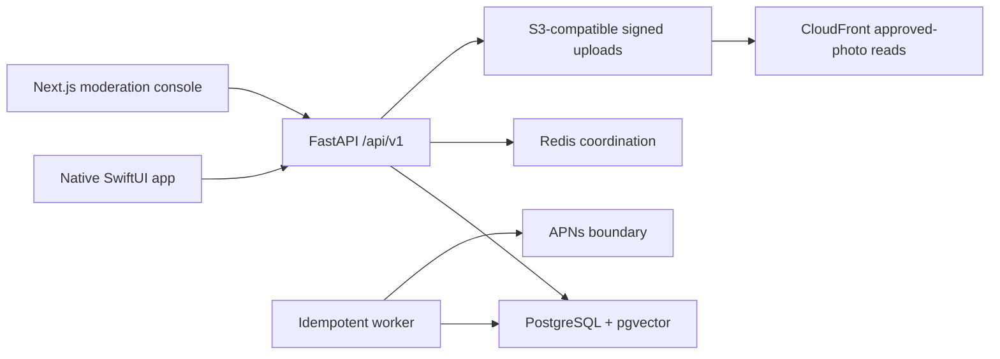

# Yard

> A native campus marketplace that makes buying and selling within the Harvard community fast, trusted, and local.

Yard turns fragmented campus resale into a clear flow: browse or search, save or reserve one available item, coordinate a public pickup, and complete the exchange. Sellers get camera-first drafting, moderated publication, engagement signals, and explicit inventory controls. Yard is independent and is not affiliated with or endorsed by Harvard University.

## Problem and product

Campus listings are scattered across group chats and general marketplaces. Availability is ambiguous, repetitive coordination is common, and useful items are hard to discover at the right moment. Yard combines Harvard-email access, server-authoritative reservations, wanted alerts, messaging, waitlists, and privacy-aware pickup coordination in a native consumer experience.

Implemented journeys include:

- Sign in with Apple, then verify an allowed Harvard email with a protected one-time code.
- Browse personalized, recent, category, free, saved, and cached inventory.
- Search lexically and semantically with structured filters and natural price/free phrases.
- Create buying intents and inspect explainable, persisted matches.
- Analyze item photos with Vision, review one or several drafts, upload directly to object storage, moderate, and publish.
- Message, reserve, join a waitlist, schedule a public pickup, share coarse ETA/status, and complete the exchange.
- Report listings, users, or messages; block direct interaction; and resolve cases through the audited admin console.

## Screenshots

App Store screenshots are intentionally not fabricated in this repository. Capture final light/dark, large-text, and core-journey screenshots from the signed Release build after production branding and API domains are configured. The required set is tracked in [the metadata checklist](docs/app-store/metadata-checklist.md).

## Architecture



PostgreSQL owns durable marketplace state. Redis is never authoritative for inventory. The iOS app caches safe state in SwiftData but sends scarce-inventory actions to the API. See [system architecture](docs/architecture.md), [iOS architecture](docs/ios-architecture.md), and [backend architecture](docs/backend-architecture.md).

## Technology

- iOS 18+: Swift 6, SwiftUI, Observation, Swift Concurrency, SwiftData, PhotosUI, Vision, MapKit, Core Location, AuthenticationServices, UserNotifications, ActivityKit, WidgetKit, XCTest.
- Backend: Python 3.12, FastAPI, Pydantic, SQLAlchemy 2, PostgreSQL 16/pgvector, Alembic, Redis, pytest, structured logging.
- Admin: TypeScript, React, Next.js.
- Production infrastructure: Terraform, ECS/Fargate, RDS, ElastiCache, private S3 + CloudFront OAC, SES, Rekognition, CloudWatch, Secrets Manager.

## Local setup

Docker is the only backend requirement; Xcode 26+ is required for the native app.

```bash
cp .env.example .env
make dev
```

API: `http://localhost:8000`; OpenAPI: `http://localhost:8000/docs`; admin: `http://localhost:3000`; Mailpit: `http://localhost:8025`. Open `ios/Yard/Yard.xcodeproj` and run the `Yard` scheme against the local API. Full details are in [local development](docs/local-development.md).

## Testing

```bash
make check
make integration-test
make load-smoke
```

`make check` rebuilds the backend, runs Ruff format/lint, mypy, backend tests, then admin lint/typecheck/tests/build. PostgreSQL integration tests prove reservation, idempotency, waitlist, and bundle race invariants. The Xcode scheme includes native unit tests; CI activation is described under known limitations because the current GitHub OAuth token cannot create workflow files.

## Marketplace correctness

Listing and reservation transitions are explicit domain services with audit events. A reservation locks the listing row, checks a buyer-scoped idempotency key twice around contention, creates a durable lease, and relies on a partial unique index as a second defense. Bundle members lock in stable order. Waitlist promotion keeps inventory unavailable to direct buyers and skips blocked users. See [reservation model](docs/reservation-model.md).

## Search and matching

PostgreSQL composes category, subcategory, condition, price, free, pickup-zone, and age filters. Natural parsing recognizes phrases such as `free lamp` and `bike under 150`. PostgreSQL full-text candidates combine with pgvector semantic candidates; lexical-only behavior remains available. Buyer-intent scores persist their real component values and are inspectable through `scripts/evaluate_matching.py`. See [search and matching](docs/search-and-matching.md).

## Privacy and security

Yard exposes coarse pickup zones, not room numbers or continuous location history. Apple identity tokens are validated server-side; verification and App Review codes are hashed, expiring, rate-limited, and single-use. Signed uploads, file-signature checks, request limits, ownership checks, blocked-interaction enforcement, admin audit logs, account deletion, notification controls, and privacy manifests are implemented. See [privacy](docs/privacy.md) and [moderation](docs/moderation.md).

## App Store status

The app includes an original icon, privacy manifest, permission descriptions, account deletion, policy/support screens, release entitlements, Live Activity extension, TestFlight notes, metadata checklist, and secure one-time App Review access grants. Distribution still requires the owner’s Apple Developer team, bundle/domain ownership, APNs key, final policy URLs, signed archives, screenshots, and App Store Connect submission. See [App Store readiness](docs/app-store-readiness.md).

## Roadmap

- Run and fix the native build/unit/UI suite on an Xcode 26 runner and complete device accessibility QA.
- Activate the prepared GitHub Actions workflow with a GitHub credential that has `workflow` scope.
- Provision a staging AWS account, restore-test the database, and exercise APNs/SES/Rekognition end to end.
- Add optional authenticated discovery filtering so blocked sellers are also excluded from browse results.
- Move synchronous publication moderation/matching and verification email delivery onto durable retryable jobs as traffic warrants.

No production users, transactions, uptime, or unmeasured performance claims are made. The recorded local k6 baseline and hardware conditions are in [load results](load/results/local-baseline.md).
