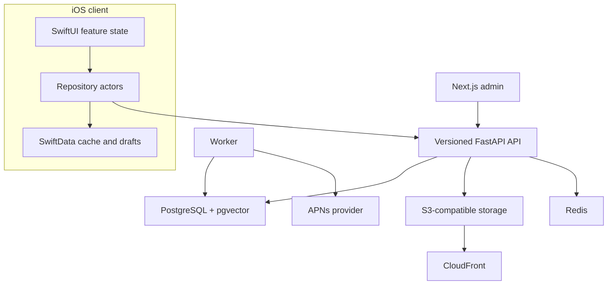

# System architecture

Yard is a modular monolith because reservation correctness benefits from one transactional database and the current product does not justify distributed ownership boundaries.

## Ownership decisions

- PostgreSQL owns users, listings, reservations, waitlists, bundles, messages, pickups, reports, notifications, and audit/analytics events.
- Redis supports rate limits and process coordination; loss of Redis cannot transfer marketplace ownership.
- Object storage owns image bytes. PostgreSQL owns image metadata and moderation state. Clients upload with signed URLs; only approved object URLs are serialized.
- SwiftData owns recoverable caches, favorites pending safe sync, conversation summaries, and listing drafts. It never owns reservation state.

## Correctness boundaries

Scarce inventory mutations run inside PostgreSQL transactions and lock rows in deterministic order. Idempotency keys turn uncertain retries into one logical effect. State machines reject arbitrary listing transitions. Operational analytics and marketplace events are written next to the business action so results remain auditable.

## Integration boundaries

Apple identity verification, SES email, Rekognition image moderation, S3, and APNs are protocols/providers with deterministic local implementations. Production configuration fails closed when required moderation or security settings are invalid; missing credentials are not disguised as successful delivery.

## Deployment shape

Terraform deploys one API task, one worker task, and one admin task by default behind an ALB, with RDS PostgreSQL, ElastiCache, private S3/CloudFront, CloudWatch, and Secrets Manager. This is a controlled-beta topology, not a high-availability claim. See [deployment](deployment.md).
